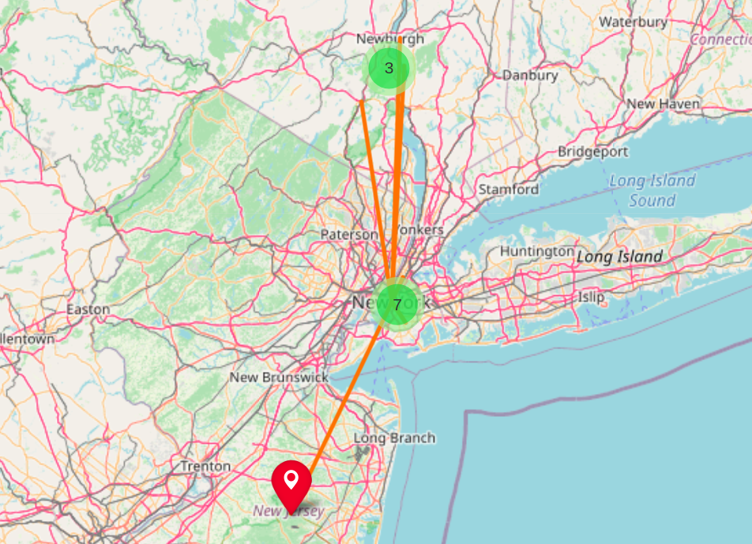

# Map project
### What this module does?
The module generates a map, where the markers are 10 closest film locations to a user's current location _(current location is passed by a user!)_.
<br>
**Note:** films are generated based on the year of their release. _(the year is defined by a user!)_

The map consists of several layers:
- map itself
- Marks (film locations)
- Connection lines between films' locations and the 'home' location which is defined by a user
***
### Getting started
```
Please enter a year you would like to have a map for: 2017
Please enter your location (format: lat, long): 40.7127281, -74.0060152
Map is generating...
Please wait...
Finished. Please have look at the map 2017_movies_map.html
```
#### Map example:

***
### Generated HTML tags:
```<!DOCTYPE html>``` file type <br>
``` <head> ... </head> ``` tag for metadata <br>
``` <body> ... </body> ``` the body of the web-page <br>
``` <script> ... </script> ``` the tag for JavaScript code <br>
``` <style> ... </style> ``` the tag for CSS code <br>
``` <div> ... </div> ``` a container for elements <br>
``` <link> ... </link>``` the tag for links